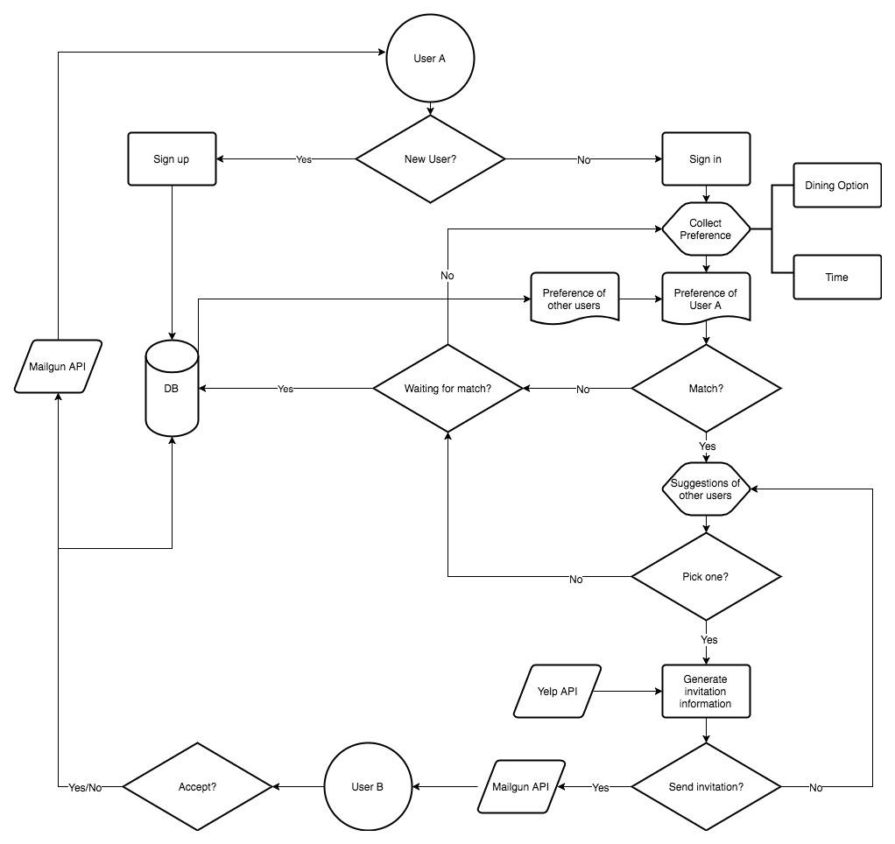

**Foodship**

**A restaurant recommendation program to foster friendship**

**Project Proposal**

Alice Yang | Jason Zhixuan Dai | Jiaxun Song | Muxuan Lyu | Zihao Fan

**Problem Statement** 

Internet is reshaping modern life, making it possible for people to reach anyone with a simple click. However, it also isolates individuals as we spend much more time in the virtual world and thus pay less attention to things around us. Metropolitans are experiencing a new kind of loneliness. We all have experienced certain times when we want to enjoy French cuisine, but can find no friends to go with, or even don’t know whom to ask.

Foodship uses technologies to re-connect people in real life. It adopts cuisine option as a priority, common interests and preferred dining time as additional features to match dining partners for our users. Foodship also recommends a nearby restaurant with Yelp API for paired users.   

**Use Cases**

1. *User registration/ sign in*: In order to provide a safe and secured environment, we first open the access of our web application only to UC Berkeley students. Therefore, users need to verify their identity using school email. Users will create their own profile indicating their name, gender, favorite cuisine and a brief description of their hobbies. Unregistered users will have the ability to browse the website, but cannot proceed with initiating a dining match.

2. *User preference collection*: After logging in, user type A (main user) will be prompted to select from dining options, price ranges and a time slot. This information will be mapped with our database to get a list of matched results for user A to choose from. 

3. *Dining partner matching*: If user type A selects another user type B (matched user) to be paired of, the system will send user type B an email invitation along with one recommended restaurant generated using Yelp API.

4. *New Dining Record*: In case there is no matching for user type A (either no choices for A or A passes all choices to decide to initiate a new Dining), the system will add an entry in database as a new dining record and user type A becomes user type B so that she/he is waiting for someone else to match the dining interest.

5. *Accept/ decline invitation*: Once the user B accepts the invitation, the user A will receive an email confirmation. If no match found or invitation has been declined, the user A can modify the preference to restart the program. 

**Assumptions and Constraints**

We set our pilot users limited to UC Berkeley students and assume every user will verify the status with school email. In user selection, we limit the option with only three variables(dining option, price range and time slot) to maximize the chance of finding a match. We also assume the users would like to try a new restaurant near UC Berkeley from our recommendation. The recommendation will be based on cuisine matching and the highest rating on Yelp since we assume users generally pick the highest rating restaurant. 

**Architecture**

1. User sign up/ login page: we will create a database storing user information. The user needs to provide school email to verify the status. 

2. Restaurant recommendation program: we will use Yelp API to recommend the highest rating restaurant based on user dining preference after successful matching.

3. Match algorithm: the dining partners will be matched by the cuisine preference, common interests and dining schedule. In order to provide a range of selection, our algorithm will run using approximate matching. 

4. Notification: When users sign up, they will receive a confirmation email. our program will also generate invitation and matching result email using Mailgun API. 

